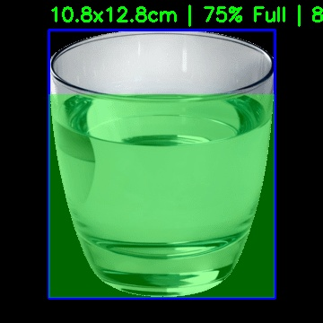

# 🍲 Food & Vessel Detection Pipeline

[](file:///Users/bercaakbayir/Desktop/projects/food-detection/Dockerfile)
[](https://huggingface.co/depth-anything/Depth-Anything-V2-Metric-Indoor-Small-hf)

A modular computer vision pipeline designed for **reference-free volume estimation**. It detects vessels, calculates real-world dimensions using metric depth maps, and identifies liquid levels even in transparent containers.



---

## 🚀 Key Features

### 1. Metric Depth Estimation (Reference-Free)
The pipeline uses **Depth-Anything-V2-Metric** to predict **absolute distance in meters** for every pixel in the scene. Unlike traditional systems, it does not require a known reference object (like a coin) or hardcoded vessel sizes.

### 2. Camera Intrinsics (EXIF Parsing)
Accuracy in size estimation depends on the camera lens. The system automatically:
- Reads **EXIF metadata** (Focal Length, 35mm Equivalent) from your photos to calibrate the "vision" scale.
- Falls back to a standard mobile FOV (65°) if metadata is missing.
- Allows manual calibration via the `--fov` argument.

### 3. Hybrid Liquid Level Detection
For transparent containers where standard segmentation fails, a specialized processor analyzes depth gradients and meniscus edge profiles to find the water/drink line.

### 4. Geometric Volume Modeling
Volume is calculated in **milliliters (ml)** by mapping 2D masks to 3D approximations:
- **Cups/Glasses**: Modeled as vertical cylinders ($V = \pi r^2 h$).
- **Bowls**: Modeled as hemi-ellipsoids ($V = \frac{2}{3} \pi r^2 h$).

---

## 🛠 Setup & Usage

### Docker (Recommended)
This project uses **uv** for ultra-fast dependency management inside the container.

1. **Start the persistent container**:
   ```bash
   docker-compose up -d --build
   ```

2. **Run detection**:
   ```bash
   docker exec food-volume-detection python main.py --path data/glass.png
   ```

### Command Line Arguments:
- `--path`: (Required) Path to the input image.
- `--fov`: (Optional) Manual Field of View override. Use `30-40` for zoomed photos or `65-75` for standard wide shots.
- `--distance`: (Optional) Manual distance in cm (e.g., `--distance 30`).
- `--device`: (Optional) `cpu`, `cuda`, or `mps`.

---

## 📂 Project Structure
- **`src/`**: 
  - `detection/`: YOLOv10 (vessel) and YOLOv8-seg (surface) inference.
  - `depth/`: Metric depth prediction using Hugging Face Transformers.
  - `processing/`: Hybrid liquid level detection logic.
  - `metrics/`: EXIF parsing and geometric volume calculation.
  - `utils/`: Structured results saving and visualization.
- **`results/`**: Persistent logs organized by image name (e.g., `results/image_name/result.jpg`).
- **`main.py`**: Clean entry point for orchestration.

---

## 💡 Best Practices for Accuracy
- **Resolution**: Use high-resolution (1080p+) original photos from your phone.
- **Metadata**: Do not strip EXIF data (e.g., via messaging apps) before inputting to the pipeline.
- **Zoom**: If your photo is cropped or zoomed, use the `--fov` override (e.g., `30`) to compensate for the digital zoom.
