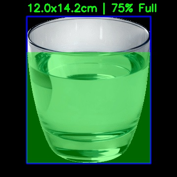

# 🍲 Food & Vessel Detection Pipeline

[](file:///Users/bercaakbayir/Desktop/projects/food-detection/Dockerfile)
[](file:///Users/bercaakbayir/Desktop/projects/food-detection/requirements.txt)

A modular computer vision pipeline designed to detect food vessels (cups, bowls, glasses), estimate their physical dimensions, and calculate the fullness percentage—even for transparent liquids.



---

## 🚀 How It Works

The pipeline follows a multi-stage process to transform a raw image into structured data:

### 1. Vessel Detection (YOLOv10)
Identify the primary container (cup, bowl, bottle, etc.) in the image. We use **YOLOv10** for its high precision and low latency in bounding box detection.

### 2. Surface Segmentation (YOLOv8-seg)
Attempt to segment the surface of the food or drink inside the container. This works best for opaque contents like soup, solids, or colored liquids.

### 3. Depth Estimation (Depth-Anything-V2)
Identify the 3D structure of the scene. This is crucial for:
- Calculating the **distance** to the object without specialized hardware.
- Detecting **liquid levels** when the content is transparent (like water).

### 4. Hybrid Liquid Detection (Fallback)
If standard segmentation fails (common with clear liquids), the pipeline analyzes depth gradients and horizontal edge profiles (meniscus) to identify the fill line inside the detected vessel.

### 5. Metrics Calculation
- **Distance**: Estimated using standard vessel widths (e.g., a cup is ~8cm) and camera focal length.
- **Physical Size**: Pixel dimensions are converted to centimeters based on the estimated distance.
- **Fullness**: Calculated using a vertical extent heuristic from vessel base to content peak.
- **Volume**: Estimated in milliliters (ml) using geometric models (cylinders for cups, hemi-ellipsoids for bowls).

---

## 🛠 Installation

### Metric Estimation (Reference-Free)
The pipeline now uses **Metric Depth Estimation** to calculate object sizes without assuming standard dimensions.
- **Accuracy Note**: For best results, use high-resolution images (1080p+) with original EXIF metadata.
- **FOV Override**: If results look unrealistic, the camera FOV might be misaligned. You can manually specify it:
  ```bash
  docker exec food-volume-detection python main.py --path data/glass.png --fov 55
  ```
- **Distance Override**: If you know the exact distance:
  ```bash
  docker exec food-volume-detection python main.py --path data/glass.png --distance 30
  ```

### Docker Setup (For Portability)
```bash
docker build -t food-detection .
docker run -v $(pwd):/app food-detection --path data/glass.png
```

### Docker Compose (Persistent Background Container)
1. **Start the container**:
   ```bash
   docker-compose up -d --build
   ```
   The container will now stay running in the background as `food-volume-detection`.

2. **Run detection on any image**:
   ```bash
   docker exec food-volume-detection python main.py --path data/glass.png
   ```
   This allows you to run multiple detections without restarting or rebuilding the container.

---

## 📖 Usage

Run the pipeline on any image:
```bash
python main.py --path data/glass.png
```

### CLI Arguments:
- `--path`: (Required) Path to the input image.
- `--distance`: (Optional) If provided, bypasses automatic distance estimation for more accuracy.
- `--device`: (Optional) Force usage of `cpu`, `cuda`, or `mps`.

---

## 📂 Project Structure
- **`src/`**: Modular logic (detection, depth, metrics, visualization).
- **`models/`**: Pre-trained YOLO weights.
- **`data/`**: Sample input images.
- **`main.py`**: Clean entry point for CLI.
- **Fullness & Volume**: Calculates vertical fill and estimates volume in milliliters (ml).
